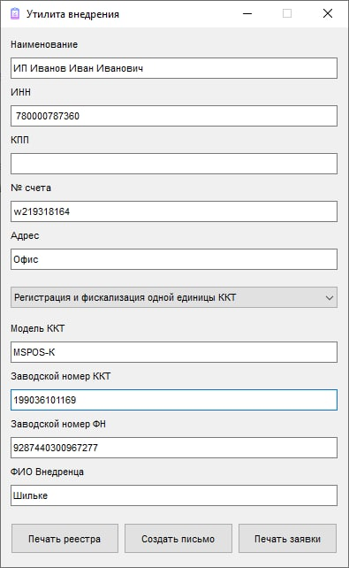

# Утилита внедрения

**Что умеет:**
- Заполнять заявку, реестр и автоматические открывать его в exel (остается только отправить на печать);
- Создавать письмо и прикладывать к нему заполненный реестр.

**Как работает:**
- Утилита заполняет необходимые ячейки exel-таблицы;
- Файл не создается с нуля, а только редактируется, изменение номера заполняемых ячеек приведет к некорректной работе;
- Все файлы реестров находятся в папке `data`;
- Текст и тему создаваемого письма, можно прописать в текстовом файле `data/text_mail.txt`;
- Дата формируется при каждом нажатии кнопки, перезагружать утилитку не требуется;
- Работать будет только в Windows, только с Exel и только с Outlook;
- При выборе услуги "Прошивка ККТ", заявка сформируется под прошивку;
- Если файл реестра или заявки открыт, новый не сформируется, требуется закрыть открытый файл;
- Шаблоны можно править под себя, главное не изменять номер автозаполняемых ячеек 

 